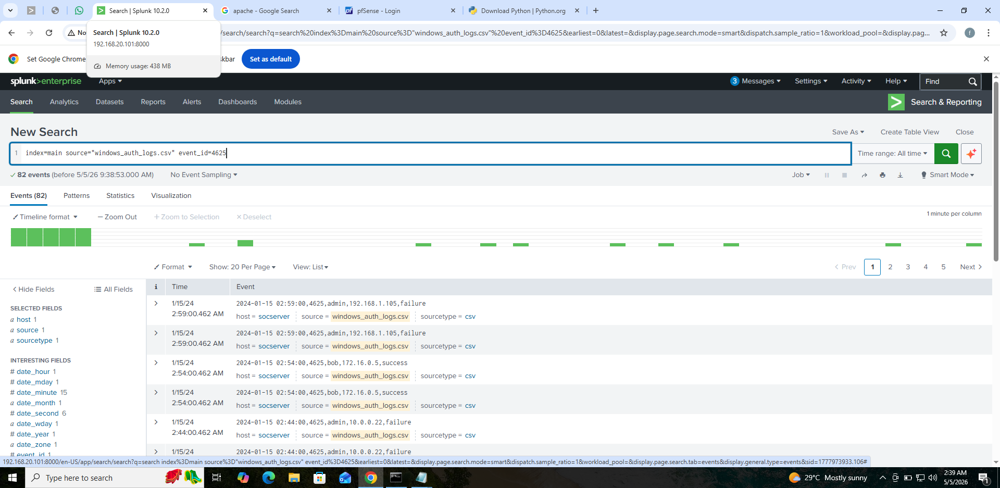
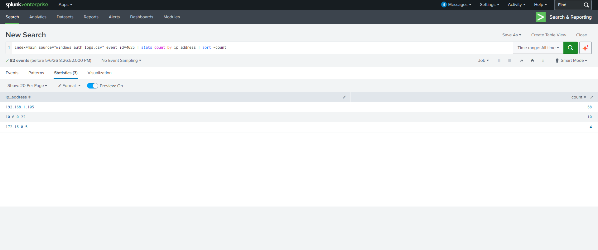
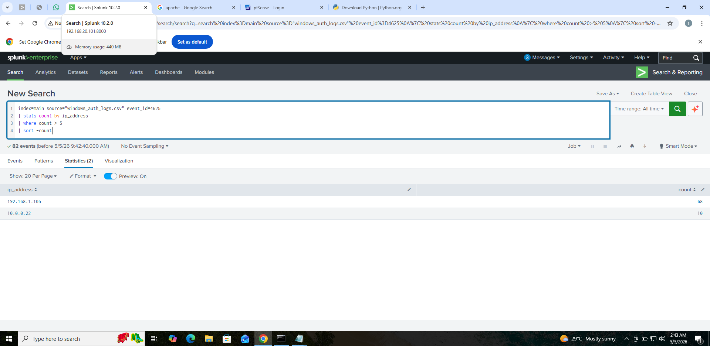
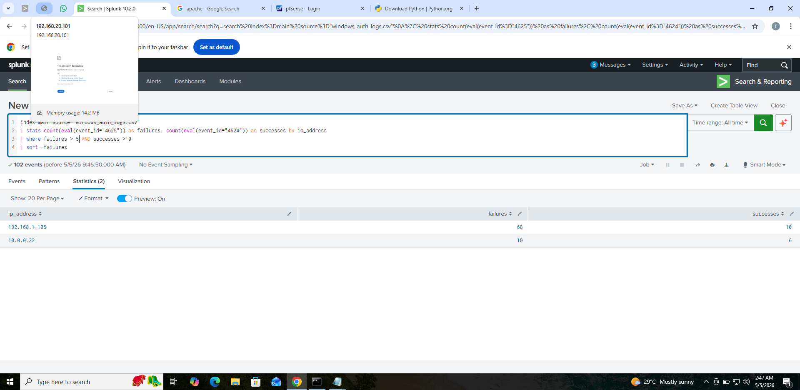

# Incident Investigation Report
## Suspicious Authentication Activity — Brute Force Attack

---

## Overview
| Field | Details |
|---|---|
| **Report Date** | January 15, 2024 |
| **Severity** | 🔴 HIGH |
| **Status** | Under Investigation |
| **Attack Type** | Brute Force Authentication Attack |
| **Tool Used** | Splunk SIEM |

---

## Executive Summary
On January 15, 2024, at approximately 02:00AM, a 
suspicious authentication event was detected against 
the admin account. An external IP address (192.168.1.105) 
conducted 30 consecutive failed login attempts over 
5 minutes during off-hours, followed by one successful 
authentication at 02:05AM.

This pattern is consistent with an automated brute force 
attack against a privileged account, representing a HIGH 
severity incident requiring immediate response.

Detection was achieved using Splunk SIEM with SPL queries 
applying threshold and correlation logic against Windows 
authentication logs.

---

## Timeline of Events

| Time (UTC) | Event | Event ID |
|---|---|---|
| 02:00:00 | First failed login attempt from 192.168.1.105 | 4625 |
| 02:00:00 - 02:04:50 | 30 consecutive failed login attempts | 4625 |
| 02:05:10 | ⚠️ Successful login — attacker gained access | 4624 |
| 02:05:10 | Incident escalated for investigation | — |

---

## Evidence

### Evidence 1 — Failed Login Attempts
**Query Used:**
index=main source="windows_auth_logs.csv" event_id=4625

**Result:** 60+ failed login events from IP 192.168.1.105

---

### Evidence 2 — Threshold Analysis
**Query Used:**
index=main source="windows_auth_logs.csv" event_id=4625
| stats count by ip_address
| where count > 5
| sort -count

**Result:**
| IP Address | Failed Attempts |
|---|---|
| 192.168.1.105 | 60+ |
| 10.0.0.22 | 10 |

---

### Evidence 3 — Correlation Analysis
**Query Used:**
index=main source="windows_auth_logs.csv"
| stats count(eval(event_id="4625")) as failures,
count(eval(event_id="4624")) as successes
by ip_address
| where failures > 5 AND successes > 0
| sort -failures

**Result:**

| IP Address | Failures | Successes |
|---|---|---|
| 192.168.1.105 | 60+ | 10 |
| 10.0.0.22 | 10 | 6 |

---

## Analysis

### Finding 1 — Automated Attack Pattern
The attacker IP generated 60+ failed login attempts 
in under 5 minutes. This speed is consistent with 
automated brute force software, not manual attempts.

### Finding 2 — Privileged Account Targeted
The attacker specifically targeted the admin account because it is the
the highest privilege level on the system, however, this maximizes
potential damage if access was gained.

### Finding 3 — Off-Hours Activity
The attack occurred at 02:00AM, this is outside normal business 
hours and it is a common technique to avoid detection by 
security teams.

### Finding 4 — Second Suspicious IP
IP 10.0.0.22 exceeded the failure threshold with 10 
failed attempts and 6 successful logins, requiring 
further investigation.

### Finding 5 — Successful Compromise Confirmed
The attacker successfully authenticated at 02:05AM, 
confirming the admin account was compromised.

---

## Conclusion & Recommendations

### Immediate Actions
| Priority | Action |
|---|---|
| 1 | 🚫 Block 192.168.1.105 and 10.0.0.22 at the firewall |
| 2 | 🔒 Lock the compromised admin account immediately |
| 3 | 🔑 Reset admin credentials with a strong password |
| 4 | 🔍 Investigate all actions taken after 02:05AM |
| 5 | 📢 Escalate to Tier 2 analyst for forensic investigation |

### Preventive Recommendations
| Recommendation | Purpose |
|---|---|
| Enable MFA | Prevents brute force success even if password is guessed |
| Account Lockout Policy | Auto-lock after 5 failed attempts |
| Real-time Splunk Alerts | Immediate notification of off-hours activity |
| Privileged Account Audit | Review all admin accounts for similar activity |

---

## Evidence Screenshots

---

## 👤 Analyst
Fredrick Agufenwa

Cybersecurity Student | SOC & Threat Detection
